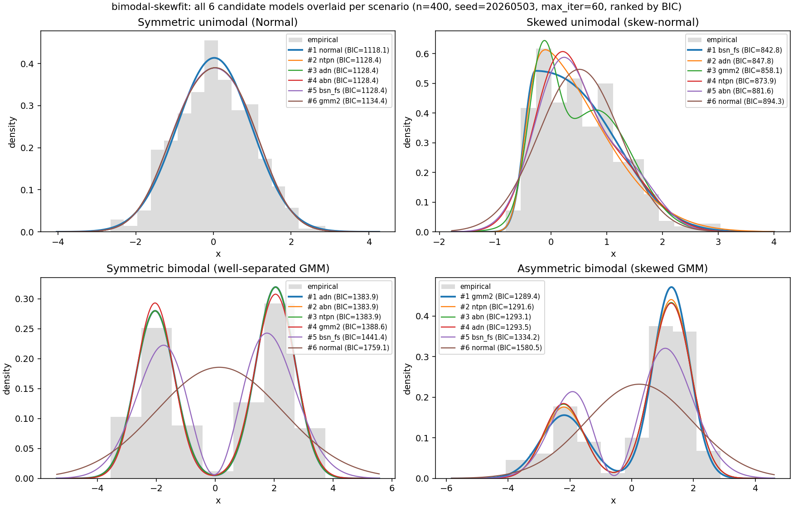

# bimodal-skewfit

単峰・二峰・歪みを持つ 1 次元データに、6 モデル (`normal` / `gmm2` / `abn` / `adn` / `bsn_fs` / `ntpn`) を一括フィットする Python ライブラリ。



> 4 つの代表シナリオに対する 6 モデル一括フィット結果 (n=400, seed=20260503, max_iter=60, BIC top-3 表示)。再生成は `uv run python scripts/build_overview_plot.py`。

## ドキュメント

| ファイル | 内容 |
| --- | --- |
| [`docs/theory_derivations_bimodal_skewfit.md`](docs/theory_derivations_bimodal_skewfit.md) ([PDF版](docs/theory_derivations_bimodal_skewfit.pdf)) | 全モデルの数式・推定対象・最適化目的・更新式・特殊ケース・サンプリング手順・評価指標を統一記法で導出 (§0〜§14)。PDF 版は pandoc + xelatex で目次・節番号付きにレンダリング済み |
| [`docs/performance_benchmarks.md`](docs/performance_benchmarks.md) | フィット時間、ランダム生成時間 (M-H 含む)、速度 × 精度 (ISE) のトレードオフ計測 |
| [`docs/implementation_inventory.md`](docs/implementation_inventory.md) | パッケージ全ファイルのレイヤー (kernel/driver/orchestration/io) 一覧、品質ゲート結果、検証コマンド |
| [`examples/fitting_report.ipynb`](examples/fitting_report.ipynb) | 実行済み Notebook。固定シナリオごとのフィット結果と密度オーバーレイ、ランダム探索の最高品質候補、ファミリ別ベスト一覧を可視化付きで載せています |

## 対象モデル

実装済みは次の 6 モデル + ベースライン skewnorm (生成専用) です。各 model 名のリンクは `docs/theory_derivations_bimodal_skewfit.md` 内の対応する節に飛びます。

| model | 概要 | 論文 / 理論文書 |
| --- | --- | --- |
| `normal` | 単一正規分布の閉形式 MLE | [§2 Normal baseline](docs/theory_derivations_bimodal_skewfit.md#2-normal-baseline) |
| `gmm2` | K=2 混合ガウス、multi-start EM | [§3 GMM K=2](docs/theory_derivations_bimodal_skewfit.md#3-二成分-gaussian-mixture-k2) |
| `abn` | 対称位置・等分散・不等重みの制約付き 2 成分 GMM | [§4 ABN](docs/theory_derivations_bimodal_skewfit.md#4-abn-asymmetric-bimodal-normal) — Mathematics 14 (5), 2026 |
| `adn` | 等重み 2 正規混合核に CDF 型歪化を掛ける | [§5 ADN](docs/theory_derivations_bimodal_skewfit.md#5-adn-asymmetric-double-normal) — Symmetry 17 (6), 2025 |
| `bsn_fs` | Fernández--Steel 型歪化 + 二峰化摂動 | [§6 BSN-FS](docs/theory_derivations_bimodal_skewfit.md#6-bsn-fs-fernándezsteel-型-bimodal-skew-normal) — arXiv:1512.03341 |
| `ntpn` | New Two-Piece Normal 型の二峰・歪分布 | [§7 NTPN](docs/theory_derivations_bimodal_skewfit.md#7-ntpn-new-two-piece-normal-extension) — AIMS Mathematics 11 (1), 2026 |

形状モデル (`abn` / `adn` / `bsn_fs` / `ntpn`) は L-BFGS-B 多項共通ドライバで推定します。詳細は [§8 形状モデル共通の直接最尤推定](docs/theory_derivations_bimodal_skewfit.md#8-形状モデル共通の直接最尤推定) を参照してください。

## 参考文献

各形状モデルは次の論文の密度関数を実装しています。Normal と GMM は標準的な内容のため出典は省略しています。

| model | 著者 | タイトル | 誌名 / プリプリント | 年 | リンク |
| --- | --- | --- | --- | --- | --- |
| `abn` | Bakouch et al. | The Asymmetric Bimodal Normal Distribution: A Tractable Mixture Model for Skewed and Bimodal Data | *Mathematics* 14 (5), 901 | 2026 | [MDPI](https://www.mdpi.com/2227-7390/14/5/901) |
| `adn` | Salinas et al. | Modeling Bimodal and Skewed Data: Asymmetric Double Normal Distribution with Applications in Regression | *Symmetry* 17 (6), 942 | 2025 | [MDPI](https://www.mdpi.com/2073-8994/17/6/942) (DOI: [10.3390/sym17060942](https://doi.org/10.3390/sym17060942)) |
| `bsn_fs` | Ehlers | A New Class of Skewed Bimodal Distributions (Fernández–Steel 型歪化 + 二峰化摂動) | arXiv:1512.03341 [math.ST] | 2015 | [arXiv abs](https://arxiv.org/abs/1512.03341) / [PDF](https://arxiv.org/pdf/1512.03341) |
| `ntpn` | Elbarougy et al. | The bimodal two-piece skew-normal distribution: Mathematical theory, reliability aging measures, and simulation-oriented decision analysis | *AIMS Mathematics* 11 (1), 511–542 | 2026 | [AIMS Press PDF](https://www.aimspress.com/aimspress-data/math/2026/1/PDF/math-11-01-022.pdf) |

実装は各論文の **密度関数とその主要特殊ケース、最尤推定、合成サンプリング** に範囲を限定しています。論文中の回帰モデル、観測情報行列、信頼性関数、分位点関数、ベイズ推定などは未実装です (詳細は [§13 監査上の注意点](docs/theory_derivations_bimodal_skewfit.md#13-監査上の注意点) 参照)。

## インストール

`uv pip` または `pip` でインストールできます。スコープ別に extras を選んでください。

```bash
# (a) ライブラリとして fit 関数だけ使う (core: numpy, scipy のみ)
uv pip install .

# (b) 固定シナリオ実験 / ランダム探索 / 可視化も使う
uv pip install '.[report]'

# (c) Notebook 生成 (build_report_notebook.py) も使う
uv pip install '.[notebook]'

# (d) 開発 (テスト・lint・型チェック・ベンチ)
uv sync --extra dev
```

`bimodal-skewfit` / `bimodal-skewfit-random` の console script、および
`scripts/run_experiment.py` / `scripts/run_random_search.py` は **pandas と matplotlib に依存**するため、`[report]` 以上の extras が必要です。最小ライブラリ用途 `(a)` だけでは `from bimodal_skewfit.experiment import ...` 等が `ModuleNotFoundError` になります (これは Python の標準挙動で、依存分離の意図された結果です)。

公開 API は `__init__.py` から再エクスポートしている次の要素に固定しています:

```python
from bimodal_skewfit import FitResult, fit_model, fit_all, list_models, __version__
```

`fit_model` / `fit_all` の戻り値 (`FitResult`) には `.logpdf(x)` / `.pdf(x)` メソッドがあるため、密度評価のために `distributions` 内部関数を直接呼ぶ必要はありません。

## 基本実行

固定シナリオを実行します。

```bash
uv run python scripts/run_experiment.py --output-dir outputs --sample-size 400 --seed 20260503 --max-iter 60
```

ランダム生成・品質探索を実行します。

```bash
uv run python scripts/run_random_search.py --output-dir outputs --trials 24 --sample-size 300 --seed 20260504 --max-iter 60
```

Notebook を生成・実行します。

```bash
uv run python scripts/build_report_notebook.py --execute
```

## 出力ファイル

| ファイル | 内容 |
| --- | --- |
| `outputs/fit_summary.csv` | 固定シナリオ別・モデル別の AIC/BIC/推定値/モード数 |
| `outputs/*_fit_overlay.png` | 固定シナリオのヒストグラムと上位フィット密度 |
| `outputs/random_search_summary.csv` | ランダム生成データに対する全モデルの品質スコア |
| `outputs/random_quality_report.md` | ランダム探索における最高品質フィットとファミリ別ベスト |
| `outputs/random_search_best_fit.png` | ランダム探索で最高品質だった試行の可視化 |
| `outputs/validation_log.md` | 品質ゲートの実検証ログ |
| `examples/fitting_report.ipynb` | 結果を確認する実行済み Notebook |
